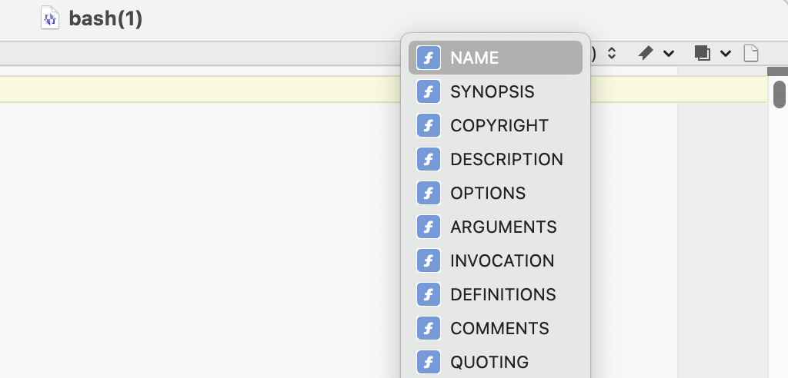

# BBEtter Manpages

This is a small BBEdit package for making BBEdit nice to use as your manpage reader, inspired by and extended from [Dr. Drang's `bman`][drang]. Dr. Drang's post also does a good job of explaining why you might want this.

[drang]: https://leancrew.com/all-this/2022/03/last-man-standing/

Double-click `BBEtter-Manpages.bbpackage` in the Finder to install. Alternatively, you can copy or symlink it into `~/Library/Application Support/BBEdit/Packages`, or wherever your BBEdit Application Support folder is. If you do this manually you'll need to restart BBEdit for it to detect the package.

## Contents

1. A [codeless language module][clm] whose primary purpose is to allow BBEdit to identify the headings in a rendered manpage so that they can be indexed in the function popup, for easier navigation of very long manpages.

   
   
   The CLM also provides extremely minimal syntax colouring: it attempts to identify quoted commands and colour them as strings. The nature of a rendered manpage is such that it's very hard to tell the difference between a command example and a paragraph of text, so expect edge cases not to be detected. 
   
   Digits in the manpage will also be coloured, because that's BBEdit's default behaviour when syntax-colouring is on. There doesn't appear to be any way to turn this off except by globally editing your colour scheme.
   
[clm]: https://www.barebones.com/support/develop/clm.html

2. A script you can set as your `$MANPAGER` in your shell so manpages open in BBEdit. (In other words: you type `man awk`, you get a BBEdit window with the `awk` manpage in it.) Unsurprisingly, this requires you to have installed the BBEdit command line tools (BBEdit &gt; Install Command Line Tools…).

   To use the script, put the following in your `.bashrc`:

   ```sh
   if [ -z "$SSH_CONNECTION" ]; then
       export MANPAGER=<path_to_this_package>/BBetter-Manpages.bbpackage/bbman.sh
   fi
   ```
   
   In theory this should also work in a `.zshrc` but I haven’t tested it.

   If you use fish (like me) instead put the following in `.config/fish/config.fish`:

   ```fish
   if status is-interactive
   and test -z $SSH_CONNECTION
	   set -xg MANPAGER <path_to_this_package>/BBetter-Manpages.bbpackage/bbman.fish
   end
   ```
   
   The fishy version uses fish's `string` builtins instead of all the painful mucking about with `sed` and `tr`.
   
   The `if` guards prevent setting BBEdit as your `$MANPAGER` if you're connected via ssh and thus BBEdit can't run. (With thanks to [this Stack Exchange question][stack].)
   
[stack]: https://unix.stackexchange.com/questions/9605/how-can-i-detect-if-the-shell-is-controlled-from-ssh
